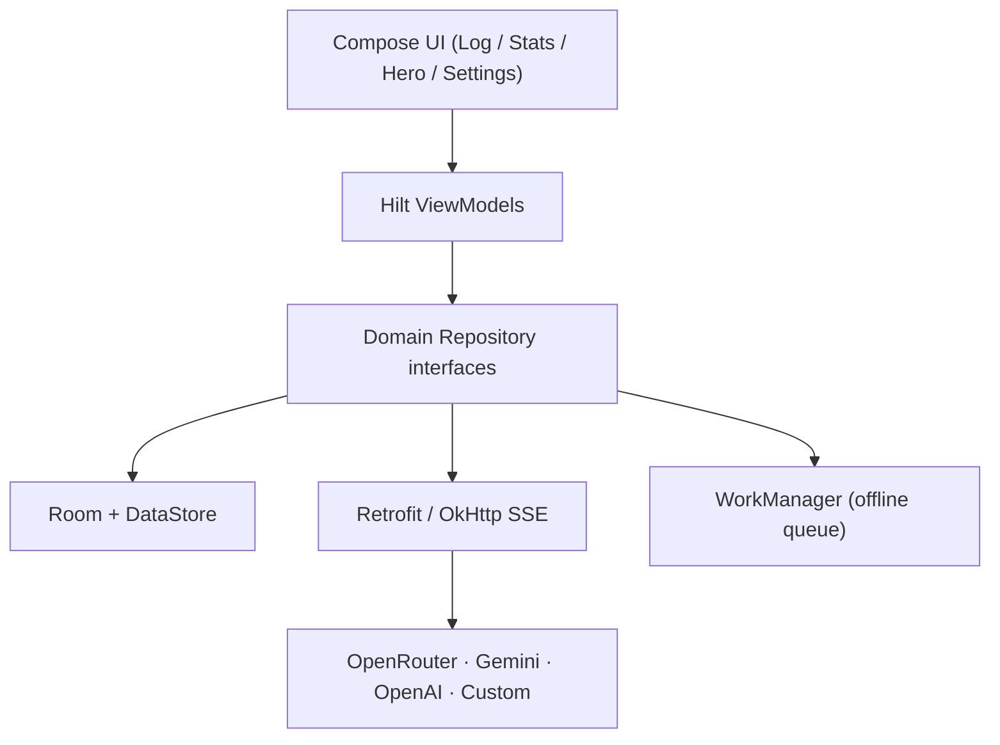

# GlucoseHero

> **A minimalist, AI-powered diabetes and health logging companion for Android.**

GlucoseHero is a privacy-first, local-first health log with a clean true-white and red clinical aesthetic. Log glucose, insulin, meals, activity, and notes in seconds - then let the built-in **Hero AI** turn natural language into structured log drafts, or check your **estimated A1c** on a rolling 90-day clinical window.

> [!IMPORTANT]
> **Not medical advice.** GlucoseHero is a logging and informational tool. It must not be used for insulin-dosing decisions or diagnosis. Always consult your healthcare provider.

---

## Overview

GlucoseHero is a native **Jetpack Compose** application built for *frictionless* health logging. Every entry lives on-device in a Room database, AI configuration is stored in Preferences DataStore, and API keys are encrypted with the hardware-backed Android KeyStore.

The interface is deliberately calm and clinical: a bright, true-white Material 3 canvas, a default **Light Red (`#FF5252`)** accent, subtle surface separation, and a strict AMOLED-black dark mode. No accounts. No telemetry. No GlucoseHero servers - the AI layer is strictly **bring-your-own-key**.

---

## Key Features

### Hero AI Assistant
Hero is a built-in chat assistant that reasons over *your* data and can prefill log entries directly.

- **OpenRouter API integration** - the network layer speaks the OpenAI-compatible `/chat/completions` dialect, so Gemini, OpenAI, OpenRouter, and self-hosted runtimes (Ollama, llama.cpp, vLLM) all work through one client.
- **Function calling** - Hero declares a `prefill_log_draft` tool with an optional-parameter JSON schema.
- **Automatic metric extraction** - when you say *“120 mg/dL, 4u basal, and a sandwich with 45 g carbs”*, Hero returns structured fields (`glucose_mgdl`, `insulin_basal_units`, `insulin_bolus_units`, `carbs_grams`, `meal_description`, `exercise_minutes`) and the **Add Entry** sheet opens pre-filled.
- **Context assembled in SQLite** - rolling 7/14/30-day averages, 14-day time-in-range, 14-day daily summaries, and the 30 most recent entries are fed to the model without iterating rows in Kotlin.
- **SSE streaming** - replies render token-by-token with a typewriter effect over a zero-read-timeout OkHttp client.
- **Offline queue** - questions asked while offline are persisted to Room and replayed by a Hilt `CoroutineWorker` when connectivity returns; a notification deep-links back to the Hero tab.

### Clinical eA1c Estimation
The Stats screen estimates A1c the same way clinicians approximate it - from average glucose.

- **90-day rolling window** computed by a single Room aggregate (`AVG(glucose_mgdl)`, reading count, distinct logged days).
- **ADAG formula** - `eA1c = (average_mgdl + 46.7) / 28.7`, implemented unit-aware for both mg/dL and mmol/L.
- **Data-confidence UI states**:
  - `INSUFFICIENT_DATA` - fewer than 14 logged days or 20 readings; the card shows exactly how many more are needed.
  - `BUILDING_ESTIMATE` - enough data for an estimate, but the full 90-day window hasn't been reached.
  - `FULL_90_DAY_WINDOW` - a mature, 90-day estimate.

### Granular Logging
A flat, multi-metric entry model makes logging fast and flexible.

- **Full CRUD** for glucose, basal/bolus insulin, and meals (carbs, protein, fat, and meal description) - plus activity and notes.
- One row can carry *multiple* metrics under a single timestamp; there is no fragile `type` column. What an event logged is always derived from which columns are non-null.
- Glucose is stored canonically in **mg/dL** and converted to mmol/L at the display layer, so SQL aggregates never need conversion.
- 90-day history grouped by day with glucose in-range/low/high status indicators and a detailed edit screen.

### Smart UI & Gamification
Small touches keep the app fast, focused, and rewarding.

- **DataStore feature flags** - `show_advanced_macros` hides protein/fat inputs for users who want a simpler meal form, alongside toggles for Hero AI, theme mode, accent color, glucose unit, 24-hour time, and target range.
- **Haptic streak micro-rewards** - saving an entry that extends your daily logging streak triggers a haptic confirmation and an animated *“Streak Extended”* chip. Streak logic lives in a pure, side-effect-free `StreakCalculator` shared by the Stats and Log flows.
- **Strong Skipping-ready UI** - log list state is `@Immutable` and backed by `kotlinx.collections.immutable`, keeping the 90-day list recomposition-cheap.

---

## Tech Stack & Architecture

| Layer | Technology |
| --- | --- |
| Language | Kotlin 2.4.10 |
| UI | Jetpack Compose, Material 3, Navigation Compose |
| Architecture | MVVM, unidirectional data flow, Hilt DI |
| Local persistence | Room 2.8.4 + Preferences DataStore |
| Reactive layer | Kotlin Coroutines, Flow / StateFlow |
| Networking | Retrofit 3, OkHttp 5, OkHttp SSE, kotlinx.serialization |
| Charts | Vico 1.15.0 |
| Background work | WorkManager + Hilt Worker |
| Security | Android KeyStore AES/GCM API-key encryption |
| Build | Gradle Version Catalog, KSP, AGP 9.3.2 |



```
app/src/main/java/com/omb9/glucosehero/
├── domain/          # Pure Kotlin models + repository contracts
├── data/
│   ├── local/       # Room, DataStore, DAOs, entities
│   ├── remote/      # AiApi, DTOs, DynamicApiInterceptor, SSE client
│   ├── repository/  # Repository implementations
│   └── security/    # Android KeyStore AES/GCM wrapper
├── di/              # Hilt modules
├── work/            # PendingQueryWorker, ConnectivityObserver, InsightNotifier
├── ui/              # Compose screens and ViewModels
│   ├── log/         # 90-day history + Add Entry draft
│   ├── stats/       # Vico charts + eA1c card
│   ├── chat/        # Hero AI assistant
│   ├── settings/    # Preferences and provider config
│   └── entrydetail/ # View/edit/delete a single entry
└── util/            # Formatters, StreakCalculator, JSON helpers
```

---

## Getting Started / Installation

### Prerequisites

- Android Studio (latest stable recommended)
- JDK 17
- Android SDK 37 (Compile SDK 37, Min SDK 26)
- A device or emulator running Android 8.0 (API 26) or newer

### Clone & Run

```bash
git clone https://github.com/USERNAME/REPO.git
cd GlucoseHero
```

Open the project root in Android Studio and let Gradle sync, then run the `app` configuration. Or build from the terminal:

```bash
./gradlew assembleDebug
```

### API Key Configuration (bring your own key)

GlucoseHero never ships with an API key. For a local, zero-commit build, add your key to the Git-ignored `local.properties` file at the project root:

```properties
# local.properties - DO NOT commit this file
sdk.dir=/path/to/your/Android/Sdk
OPEN_ROUTER_API_KEY="your_key_here"
```

> [!NOTE]
> `local.properties` is automatically generated by Android Studio and is already excluded from version control. Keeping your key here ensures the app compiles locally without hardcoding secrets. You can also enter the same key at runtime under **Settings → Hero AI**, where it is AES/GCM-encrypted into the Android KeyStore before it ever touches DataStore.

| Provider | Default model | Key source |
| --- | --- | --- |
| Gemini (default) | `gemini-2.0-flash` | https://aistudio.google.com/apikey |
| OpenAI | `gpt-4o-mini` | https://platform.openai.com/api-keys |
| OpenRouter | `google/gemini-2.0-flash-001` | https://openrouter.ai/keys |
| Custom (OpenAI-compatible) | `llama3.1` | none required |

