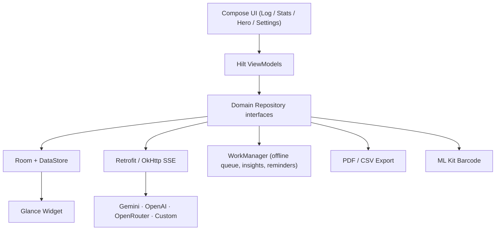

# GlucoseHero

> **A minimalist, AI-powered diabetes and health logging companion for Android.**

GlucoseHero is a privacy-first, local-first health log with a clean true-white and red clinical aesthetic. Log glucose, insulin, meals, activity, and notes in seconds - then let the built-in **Hero AI** turn natural language into structured log drafts, check your **estimated A1c** on a rolling 90-day clinical window, track your **supplies**, and get **nightly pattern insights**.

> [!IMPORTANT]
> **Not medical advice.** GlucoseHero is a logging and informational tool. It must not be used for insulin-dosing decisions or diagnosis. Always consult your healthcare provider.

---

## Overview

GlucoseHero is a native **Jetpack Compose** application built for *frictionless* health logging. Every entry lives on-device in a Room database, preferences are stored in Preferences DataStore, and API keys are encrypted with the hardware-backed Android KeyStore.

The interface is deliberately calm and clinical: a bright, true-white Material 3 canvas, a default **Light Red (`#FF5252`)** accent, subtle surface separation, and a strict AMOLED-black dark mode. No accounts. No telemetry. No GlucoseHero servers - the AI layer is strictly **bring-your-own-key**.

---

## Key Features

### Hero AI Assistant
Hero is a built-in chat assistant that reasons over *your* data and can prefill log entries directly.

- **OpenRouter-compatible clients** - the network layer speaks the OpenAI-compatible `/chat/completions` dialect, so Gemini, OpenAI, OpenRouter, and self-hosted runtimes (Ollama, llama.cpp, vLLM) all work through one client.
- **Function calling** - Hero declares a `prefill_log_draft` tool with an optional-parameter JSON schema.
- **Automatic metric extraction** - when you say *“120 mg/dL, 4u basal, and a sandwich with 45 g carbs”*, Hero returns structured fields (`glucose_mgdl`, `insulin_basal_units`, `insulin_bolus_units`, `carbs_grams`, `meal_description`, `exercise_minutes`) and the **Add Entry** sheet opens pre-filled.
- **Context assembled in SQLite** - rolling 7/14/30-day averages, 14-day time-in-range, 14-day daily summaries, and the 30 most recent entries are fed to the model without iterating rows in Kotlin.
- **SSE streaming** - replies render token-by-token with a typewriter effect over a zero-read-timeout OkHttp client.
- **Offline queue** - questions asked while offline are persisted to Room and replayed by a Hilt `CoroutineWorker` when connectivity returns; a notification deep-links back to the Hero tab.
- **Persona-aware prompts** - an optional profile (self, child, partner, parent, or patient) tailors pronouns and clinical context.

### Clinical eA1c Estimation
The Stats screen estimates A1c the same way clinicians approximate it - from average glucose.

- **90-day rolling window** computed by a single Room aggregate (`AVG(glucose_mgdl)`, reading count, distinct logged days).
- **ADAG formula** - `eA1c = (average_mgdl + 46.7) / 28.7`, implemented unit-aware for both mg/dL and mmol/L.
- **Data-confidence UI states**:
  - `INSUFFICIENT_DATA` - fewer than 14 logged days or 20 readings; the card shows exactly how many more are needed.
  - `BUILDING_ESTIMATE` - enough data for an estimate, but the full 90-day window hasn't been reached.
  - `FULL_90_DAY_WINDOW` - a mature, 90-day estimate.

### Granular Logging
A flat, multi-metric entry model makes logging fast and flexible.

- **Full CRUD** for glucose, basal/bolus insulin, and meals (carbs, protein, fat, and meal description) - plus activity and notes.
- One row can carry *multiple* metrics under a single timestamp; there is no fragile `type` column. What an event logged is always derived from which columns are non-null.
- Glucose is stored canonically in **mg/dL** and converted to mmol/L at the display layer, so SQL aggregates never need conversion.
- 90-day history grouped by day with glucose in-range/low/high status indicators and a detailed edit screen.
- **Meal contexts** (fasting, before/after meal, bedtime), **activity intensity**, and an optional **+2-hour post-meal reminder** on meal and bolus entries.

### Smart Bolus & Insulin-on-Board (IOB)
- **Live IOB** - the Log screen shows a live "Active Insulin" bar that decays minute-by-minute using a linear DIA model.
- **Smart bolus recommendation** - `(carbs / CIR) + ((current − target) / ISF) − IOB`, recomputed reactively as you type carbs and glucose and surfaced as a one-tap suggestion in the Add Entry and edit screens.
- **Configurable dosing parameters** - duration of insulin action (DIA), carb-to-insulin ratio (CIR), insulin sensitivity factor (ISF), and target glucose.

### Supply Tracker
- Track **sensor**, **insulin vial**, and **pump site** hardware with configurable lifespans.
- Active supplies show progress, days/hours remaining, and an expired/replace state.
- Starting a replacement atomically retires the previous supply of the same type.

### Meal Photo & Barcode Scanning
- Capture a **meal photo** from the Add Entry sheet (camera permission optional).
- **ML Kit barcode scanning** extracts UPC/EAN barcodes from the photo, shown inline in the meal form.

### Pattern-Recognition Insights
- A nightly **WorkManager** job (charging + idle, 3 AM) analyzes the last 14 days of glucose data and persists insight cards for:
  - frequent overnight lows,
  - recurring time-of-day lows/highs,
  - high-variability periods.
- Insights render as cards on the Stats screen with severity-based styling.

### Clinical Export
- Export the last 90 days as **PDF** or **CSV** directly from the Stats screen's share sheet.
- PDF reports include the patient profile, estimated A1c, and a paginated entry table.

### Home-Screen Widget
- A **Jetpack Glance** widget surfaces the most recent glucose reading (or an empty state).
- Tapping it deep-links into the Add Entry sheet with the Glucose tab pre-selected.

### Smart UI & Gamification
Small touches keep the app fast, focused, and rewarding.

- **DataStore preferences** - theme mode (System / Light / AMOLED), accent color (6 options), glucose unit, 24-hour time, target range, advanced macros, post-meal reminders, Hero AI provider, and dosing parameters.
- **Haptic streak micro-rewards** - saving an entry that extends your daily logging streak triggers a haptic confirmation and an animated *“Streak Extended”* chip. Streak logic lives in a pure, side-effect-free `StreakCalculator` shared by the Stats and Log flows.
- **Strong Skipping-ready UI** - log list state is `@Immutable` and backed by `kotlinx.collections.immutable`, keeping the 90-day list recomposition-cheap.
- **Stats trends** - average glucose and time-in-range compare against the immediately preceding window, with up/down/flat indicators.

---

## Tech Stack & Architecture

| Layer | Technology |
| --- | --- |
| Language | Kotlin 2.4.10 |
| UI | Jetpack Compose, Material 3, Navigation Compose |
| Architecture | MVVM, unidirectional data flow, Hilt DI |
| Local persistence | Room 2.8.4 + Preferences DataStore |
| Reactive layer | Kotlin Coroutines, Flow / StateFlow |
| Networking | Retrofit 3, OkHttp 5, OkHttp SSE, kotlinx.serialization |
| Charts | Vico 1.15.0 |
| Background work | WorkManager + Hilt Worker |
| Home screen | Jetpack Glance |
| Vision | Google ML Kit barcode scanning |
| Image loading | Coil 3 |
| Monetization scaffold | Play Billing 9 (subscriptions; not yet surfaced in UI) |
| Security | Android KeyStore AES/GCM API-key encryption |
| Build | Gradle Version Catalog, KSP, AGP 9.3.2, compile/target SDK 37 |



```
app/src/main/java/com/omb9/glucosehero/
├── domain/          # Pure Kotlin models + repository contracts
├── data/
│   ├── local/       # Room (DB, DAOs, entities, migrations) + DataStore
│   ├── remote/      # AiApi, DTOs, DynamicApiInterceptor, SSE client
│   ├── repository/  # Repository implementations
│   ├── security/    # Android KeyStore AES/GCM wrapper
│   ├── billing/     # Play Billing subscription client (scaffold)
│   ├── export/      # PDF/CSV clinical report generator
│   └── vision/      # ML Kit barcode scanning adapter
├── di/              # Hilt modules
├── work/            # PendingQuery, PatternRecognition, PostMealReminder workers + notifiers
├── ui/              # Compose screens and ViewModels
│   ├── log/         # 90-day history + Add Entry draft
│   ├── stats/       # Vico charts, eA1c, supplies, insights, export
│   ├── chat/        # Hero AI assistant
│   ├── settings/    # Preferences and provider config
│   ├── entrydetail/ # View/edit/delete a single entry
│   ├── glance/      # Home-screen widget
│   ├── components/  # AddEntrySheet
│   └── theme/       # Light + AMOLED themes, typography
└── util/            # Formatters, Streak/IOB/Bolus/Supply calculators, hashtag extraction
```

> [!NOTE]
> Two capabilities are implemented at the data layer but **not yet wired to a visible screen**: Play Billing subscription entitlements (`BillingRepository` + `SettingsViewModel.isPremium`) and per-hashtag glucose analytics (`AnalyticsRepository` / `HashtagExtractor`). They are included for completeness but have no user-facing UI yet.

---

## Getting Started / Installation

### Prerequisites

- Android Studio (latest stable recommended)
- JDK 17
- Android SDK 37 (Compile SDK 37, Min SDK 26)
- A device or emulator running Android 8.0 (API 26) or newer

### Clone & Run

```bash
git clone https://github.com/USERNAME/REPO.git
cd GlucoseHero
```

Open the project root in Android Studio and let Gradle sync, then run the `app` configuration. Or build from the terminal:

```bash
./gradlew assembleDebug
```

### API Key Configuration (bring your own key)

GlucoseHero never ships with an API key. Enter your key at runtime under **Settings → Hero AI**, where it is AES/GCM-encrypted into the Android KeyStore before it ever touches DataStore.

| Provider | Default model | Key source |
| --- | --- | --- |
| Gemini (default) | `gemini-2.0-flash` | https://aistudio.google.com/apikey |
| OpenAI | `gpt-4o-mini` | https://platform.openai.com/api-keys |
| OpenRouter | `google/gemini-2.0-flash-001` | https://openrouter.ai/keys |
| Custom (OpenAI-compatible) | `llama3.1` | none required |

> [!NOTE]
> Self-hosted "Custom" endpoints (for example an Ollama box at `http://<host>:11434/v1/`) typically need no key. Base URL and model are editable in Settings.

---

## Roadmap

- **Wear OS support** - glanceable glucose, time-in-range, and logging complications for your wrist.
- **Surface the existing scaffolds** - expose Play Billing subscription entitlements and per-hashtag analytics in the UI.

---

## Contributing

Contributions are welcome. Please open an issue first to discuss feature work, keep pull requests focused, and follow the existing package-by-layer structure and Kotlin conventions used throughout the codebase.
